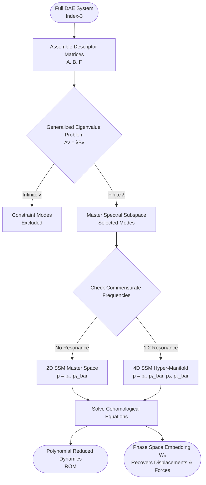

# Model Reduction of Constrained Mechanical Systems
### via Spectral Submanifolds (SSMs)
License: MIT
MATLAB
SSMTool
*A draft study on exact model reduction for mechanical systems subject to holonomic algebraic configuration constraints, building upon the foundational Spectral Submanifold theory developed by Prof. George Haller and researchers at ETH Zürich.*

## 💡 Executive Summary
Dynamical systems in engineering are frequently subjected to algebraic configuration constraints alongside their governing ordinary differential equations (ODEs), rendering them as **Differential-Algebraic Equations (DAEs)**. Simulating high-dimensional constrained systems is computationally expensive and obfuscates underlying nonlinear modal interactions.
This repository explores the mathematical reduction of constrained mechanical systems. By casting the DAEs into a first-order descriptor form, we can seamlessly extend **Spectral Submanifold (SSM)** parameterization to digest these constraints natively—without the need for explicit index-reduction algorithms or coordinate partitioning.
### 🔑 Key Theoretical Highlights
 * **Descriptor-Form Processing:** Directly operates on index-3 DAEs.
 * **Internal Resonance Resolution:** Demonstrates the failure of classical 2D invariant manifolds under a 1:2 internal resonance (\omega_2 \approx 2\omega_1) and resolves it via a **4D Spectral Hyper-Manifold**.
 * **Constraint Force Extraction:** Directly recovers the dynamic Lagrange multipliers (\lambda) from the geometry of the manifold.
## 📐 Mathematical Formulation Preview
GitHub natively supports LaTeX rendering. Below is the theoretical formulation driving the reduced-order models.
### 1. Descriptor DAE System
The governing equations for a mechanical system with n_c holonomic constraints g(x) = 0 are defined as:
By defining the augmented state vector z = (x, \dot{x}, \mu)^T, we map the system into a first-order descriptor form:
Where the global linear matrices \mathbf{A} and \mathbf{B} cleanly separate the inertial dynamics from the algebraic constraints:
### 2. The Invariance Equation
The autonomous SSM is defined by an embedding function W_0(p) and its reduced internal dynamics R_0(p), which must exactly satisfy the invariance equation:
> [!TIP]
> **Polynomial Expansion**
> Solving this equation via multivariate Taylor series expansion yields a sequence of linear cohomological equations, allowing for analytical extraction of the manifold up to arbitrary high orders (e.g., \mathcal{O}(11)).
> 
## 🗺️ Reduction Architecture
The logic flow from the full-order DAE to the low-dimensional ODE Reduced-Order Model (ROM) is visualized below:

## 🧪 Benchmark: Hyperbolic Paraboloid Oscillator
To demonstrate the necessity of correct subspace selection, the framework is applied to a 3-DOF oscillator strictly confined to a hyperbolic paraboloid manifold:
The system is specifically tuned such that the principal curvature modes exhibit a 1:2 internal resonance (\omega_2 = 4.0, \omega_1 = 2.0).
> [!WARNING]
> **Topological Breakdown of 2D Manifolds**
> During 1:2 internal resonance, standard 2D manifolds suffer from "small divisor" singularities because the matrix [(2\lambda_1)B - A] becomes strictly singular. The trajectory physically escapes the 2D plane, necessitating the 4D SSM approach used in this repository.
> 
### Verification Metrics
Comparison of the 4D SSM prediction (\mathcal{O}(9) expansion) against a direct Index-1 stabilized numerical integration of the full-scale system reveals extreme precision:

| State Variable | Max Absolute Error | RMS Error | Relative L_2 Norm |
| :--- | :--- | :--- | :--- |
| **x_1 (Mode 1)** | 1.34 \times 10^{-6} | 7.19 \times 10^{-7} | 1.42 \times 10^{-3} |
| **x_2 (Resonant Mode 2)** | 4.68 \times 10^{-9} | 2.43 \times 10^{-9} | 1.75 \times 10^{-6} |
| **x_3 (Constrained Axis)** | 1.79 \times 10^{-7} | 5.14 \times 10^{-8} | 1.75 \times 10^{-5} |
| **\lambda (Constraint Force)** | 1.09 \times 10^{-5} | 1.12 \times 10^{-6} | 1.84 \times 10^{-5} |

## 📚 Acknowledgments & Literature
This study relies on the fundamental advancements in spectral submanifold theory and constrained mechanical reduction. Key literature includes:
 1. **Haller, G., & Ponsioen, S. (2016).** *Nonlinear normal modes and spectral submanifolds: existence, uniqueness and use in model reduction.* Nonlinear Dynamics, 86(3), 1493-1534.
 2. **Li, M., Jain, S., & Haller, G. (2023).** *Model reduction for constrained mechanical systems via spectral submanifolds.* Nonlinear Dynamics, 111, 8881-8911.
 3. **Shaw, S. W., & Pierre, C. (1993).** *Normal modes for non-linear vibratory systems.* Journal of Sound and Vibration, 164(1), 85-124.

Distributed under the MIT License.

