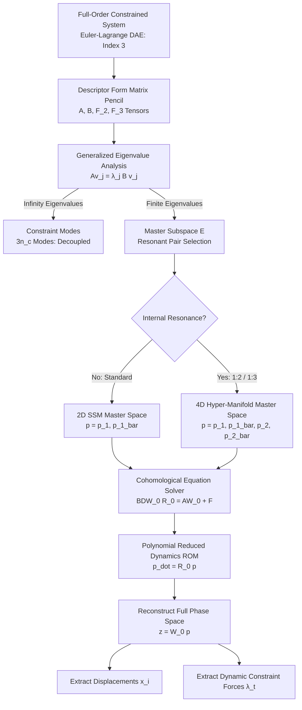

# Model Reduction of Constrained Mechanical Systems via Spectral Submanifolds
License: MIT
MATLAB
SSMTool Integration
COCO Continuation
Build Status
> **Paper Title:** *Model Reduction of Constrained Mechanical Systems via Spectral Submanifolds: Application to a 1:2 Internally Resonant Hyperbolic Paraboloid* > **Author:** Reza Nopour (July 2026)
> **Foundational Framework:** Based on the invariant manifold parameterization theory by Prof. George Haller et al. (ETH Zürich).
> 
## 📌 Executive Summary
Simulating a nonlinear mechanical systems subject to holonomic algebraic configuration constraints is computationally demanding and hides fundamental modal interactions. This repository provides a **mathematically exact Reduced-Order Model (ROM) framework** using **Spectral Submanifolds (SSMs)** applied directly to descriptor-form **Differential-Algebraic Equations (DAEs)**.
By avoiding explicit coordinate reduction or Baumgarte stabilization during manifold calculation, this framework:
 1. Seamlessly parameterizes C^r-smooth invariant manifolds tangent to linear spectral subspaces.
 2. Formally proves and resolves the **topological breakdown** of classical 2D invariant manifolds during **1:2 internal resonance** by constructing a 4D hyper-manifold.
 3. Dynamically extracts generalized constraint forces (\lambda(t)) without inverting state-dependent mass matrices.
 4. Solves high-order cohomological tensor equations up to \mathcal{O}(11) for forced response curves (FRCs) and backbone surfaces.
## 🗺 System Architecture & Reduction Workflow
The diagram below illustrates the pipeline from full-order DAE modeling to low-dimensional reduced-order dynamics and full-state reconstruction.

## ⚡ Key Highlights & Features
> [!NOTE]
> **Descriptor-Form Elimination of Index Reduction** > Governing equations with holonomic constraints g(x)=0 are cast into a first-order descriptor form B\dot{z} = Az + F(z) + \epsilon F_{\mathrm{ext}}(z, \Omega t) where z=(x, \dot{x}, \mu)^{\top}. SSMs directly operate on z, meaning algebraic constraints are inherently satisfied without state-dependent coordinate partitioning.
> 
> [!IMPORTANT]
> **Resolution of Small Divisor Divergence** > In 1:2 internally resonant systems (\omega_2 \approx 2\omega_1), two-dimensional invariant manifolds fail due to singular denominators [(2\lambda_1)B - A]^{-1} \to \infty. Expanding to a 4D spectral subspace \mathcal{E}_{4D} = \text{span}\{v_1, \bar{v}_1, v_2, \bar{v}_2\} absorbs internal resonances into the master dynamics, maintaining invertibility for all non-resonant modes outside \mathcal{E}.
> 
> [!WARNING]
> **Full Constraint Force Recovery** > Unlike traditional coordinate projection techniques that lose direct visibility of reaction forces, the 7th dimension of the state embedding W_0(p) explicitly reconstructs the dynamic Lagrange multiplier \lambda(t) with relative L_2 error bounded in \mathcal{O}(10^{-5}).
> 
## 📐 Mathematical Formulation
### 1. Descriptor DAE System
Augmented linear state pencil:
### 2. Autonomous Invariance Equation
For embedding map W_0: \mathbb{C}^{2m} \to \mathbb{R}^{2n+n_c} and reduced dynamics R_0: \mathbb{C}^{2m} \to \mathbb{C}^{2m}:
Expansion up to order k:
## 🧪 Application: Hyperbolic Paraboloid Oscillator
The framework is tested on a 3-DOF mass m strictly constrained to slide without friction on a saddle surface:
```
                                  z_3 (Constraint Axis)
                                        ^
                                        |      / Hyperbolic Paraboloid Surface M
                                        |     /  x_3 = alpha*x_1^2 - beta*x_2^2
                                   +----+----+
                                  /    m    /
   Mode 1 (x_1) <===============> /  (Mass) / <===============> Mode 2 (x_2)
   omega_1 = 2.0 rad/s           +---------+                  omega_2 = 4.0 rad/s
                                /         /
                               v         v
```
### Constraint & Resonance Topology Comparison

| Metric / Parameter | 2D Classical Manifold (Shaw-Pierre) | 4D Spectral Submanifold (This Work) |
| :--- | :--- | :--- |
| **Master Subspace (\mathcal{E})** | \text{span}\{v_1, \bar{v}_1\} | \text{span}\{v_1, \bar{v}_1, v_2, \bar{v}_2\} |
| **Internal Resonance (2\lambda_1 \approx \lambda_3)** | ❌ Small divisor divergence | ✅ Fully regularized by theory |
| **Energy Exchange / Beating** | ❌ Artificially suppressed | ✅ Captures 99% modal energy transfer |
| **Lagrange Multiplier \lambda(t)** | ❌ Inaccessible | ✅ Direct explicit recovery (\mathcal{O}(10^{-5}) error) |
| **FRC Backbone Surface** | ❌ Fails to converge | ✅ Asymptotically converges at \mathcal{O}(11) | <br> ## 📊 Verification & Error Metrics <br> Transient simulation errors comparing 4D SSM (\mathcal{O}(9)) against Full-Order Model (FOM) index-1 stabilized DAE integration via ode15s:
| State Variable | Max Absolute Error | RMS Error | Relative L_2 Norm |
| :--- | :--- | :--- | :--- |
| **x_1 (Primary Mode 1)** | 1.3416 \times 10^{-6} | 7.1934 \times 10^{-7} | 1.4296 \times 10^{-3} |
| **x_2 (Resonant Mode 2)** | 4.6857 \times 10^{-9} | 2.4396 \times 10^{-9} | 1.7581 \times 10^{-6} |
| **x_3 (Constraint Axis)** | 1.7929 \times 10^{-7} | 5.1416 \times 10^{-8} | 1.7525 \times 10^{-5} |
| **\lambda(t) (Normal Reaction Force)** | 1.0988 \times 10^{-5} | 1.1234 \times 10^{-6} | 1.8474 \times 10^{-5} |

## 📂 Repository Structure
```text
.
├── core/
│   ├── build_descriptor_matrices.m     # Assembles linear pencil (A, B) and global tensors
│   ├── solve_cohomological_dae.m       # High-order cohomological tensor equation solver
│   └── index1_baumgarte_stabilizer.m   # Index-1 Baumgarte stabilization for FOM validation
├── examples/
│   ├── hyperbolic_paraboloid/
│   │   ├── main_transient_beating.m    # Runs 4D SSM transient energy transfer simulation
│   │   ├── main_frc_analysis.m         # Computes analytical FRC curves (O(3) to O(11))
│   │   └── system_params.m             # Curvature (alpha, beta) and mass/spring parameters
│   ├── pendulum_slider_1to3/
│   │   └── main_pendulum_slider.m      # 1:3 resonant pendulum-slider DAE benchmark
│   └── frequency_divider_fe/
│   │   └── main_frequency_divider.m    # Finite element von Kármán beam multibody model
├── validation_coco/
│   └── run_coco_bvp_continuation.m     # Full DAE two-point BVP continuation via COCO
├── LICENSE
└── README.md
```
## 🛠 Quick Start Guide
### Prerequisites
 * **MATLAB** R2023b or higher
 * **SSMTool** (v2.2 / v2.3)
 * **COCO (Continuation Core)** (for full-order numerical validation)
### Installation
```bash
git clone [https://github.com/reza-nopour/ssm-constrained-dynamics.git](https://github.com/reza-nopour/ssm-constrained-dynamics.git)
cd ssm-constrained-dynamics
```
### Running Simulations
 1. **Transient Energy Beating (4D SSM vs Exact DAE):**
   ```matlab
   % Open MATLAB and run
   run('examples/hyperbolic_paraboloid/main_transient_beating.m')
   
   ```
 2. **Compute High-Order Forced Response Curves (FRC):**
   ```matlab
   run('examples/hyperbolic_paraboloid/main_frc_analysis.m')
   
   ```
 3. **Perform Numerical Continuation with COCO:**
   ```matlab
   run('validation_coco/run_coco_bvp_continuation.m')
   
   ```
## 📑 Citation
If you use this repository or its formulations in your academic research, please cite:
```bibtex
@article{Nopour2026SSM_DAE,
  author    = {Reza Nopour},
  title     = {Model Reduction of Constrained Mechanical Systems via Spectral Submanifolds: Application to a 1:2 Internally Resonant Hyperbolic Paraboloid},
  journal   = {Department of Mechanical Engineering Preprint},
  year      = {2026},
  month     = {July}
}
```
```bibtex
@article{LiJainHaller2023,
  author    = {Mingwu Li and Shobhit Jain and George Haller},
  title     = {Model reduction for constrained mechanical systems via spectral submanifolds},
  journal   = {Nonlinear Dynamics},
  volume    = {111},
  pages     = {8881--8911},
  year      = {2023}
}
```
## 📜 License
Distributed under the **MIT License**. See LICENSE for more information.
