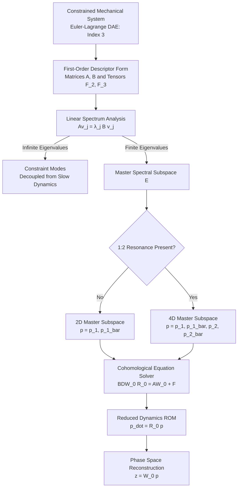

# Model Reduction of Constrained Mechanical Systems via Spectral Submanifolds
License: MIT
MATLAB
SSMTool Integration
> **Overview:** A draft study on exact model reduction for mechanical systems subject to holonomic algebraic configuration constraints, based on Spectral Submanifold (SSM) theory developed by Prof. George Haller's group (ETH Zürich).
> 
## 📌 Summary
Mechanical systems with algebraic constraints are traditionally formulated as Differential-Algebraic Equations (DAEs). Full-scale simulations of such constrained systems are computationally expensive and can obscure underlying modal interactions.
This repository explores the application of **Spectral Submanifolds (SSMs)** to descriptor-form DAEs. By parameterizing invariant manifolds tangent to linear spectral subspaces, reduced-order models (ROMs) composed purely of ODEs can be constructed while preserving the underlying phase space geometry.
### Key Concepts Covered
 * **Descriptor-Form Parameterization:** Direct handling of index-3 DAEs without explicit index reduction or coordinate partitioning.
 * **1:2 Internal Resonance:** Demonstration of why classical 2D invariant manifolds break down during commensurate frequency ratios (w_2 \approx 2w_1) due to small divisors, and how a 4D SSM master subspace resolves the issue.
 * **Constraint Force Extraction:** direct recovery of dynamic Lagrange multipliers (\lambda) from the manifold embedding.
 * **Forced Response & Backbones:** Analytic approximation of Forced Response Curves (FRCs) and backbone surfaces up to high Taylor expansion orders.
## 🗺 Method Overview
The reduction pipeline from a constrained DAE system to reduced dynamics is summarized below:

## 📐 Mathematical Formulation
### 1. Descriptor DAE System
The governing equations of a mechanical system with n_c holonomic constraints g(x) = 0 are:
```math
M \ddot{x} + C \dot{x} + K x + f_{nl}(x,\dot{x}) + G(x)^T \mu = \epsilon f_{ext}(x,\dot{x},\Omega t)
```
```math
g(x) = 0
```
By defining the augmented state vector z = (x, \dot{x}, \mu)^T, the system is written in first-order descriptor form:
```math
B \dot{z} = A z + F(z) + \epsilon F_{ext}(z, \Omega t)
```
where the linear matrices A and B are defined as:
```math
A = \begin{bmatrix} -K & 0 & -G_0^T \\ 0 & M & 0 \\ G_0 & 0 & 0 \end{bmatrix}, \quad B = \begin{bmatrix} C & M & 0 \\ M & 0 & 0 \\ 0 & 0 & 0 \end{bmatrix}
```
### 2. Invariance Equation
The autonomous SSM embedding W_0(p) and reduced vector field R_0(p) satisfy the invariance equation:
```math
B D W_0(p) R_0(p) = A W_0(p) + F(W_0(p))
```
Expanding W_0(p) and R_0(p) as Taylor series yields a sequence of linear cohomological equations at each order k \ge 2.
## 🧪 Benchmark System: Hyperbolic Paraboloid Oscillator
The theory is evaluated on a 3-DOF oscillator constrained to slide on a hyperbolic paraboloid surface:
```math
g(x) = x_3 - \alpha x_1^2 + \beta x_2^2 = 0
```
```text
                                  x_3 (Constraint Axis)
                                        ^
                                        |      / Hyperbolic Paraboloid Surface M
                                        |     /  x_3 = alpha*x_1^2 - beta*x_2^2
                                   +----+----+
                                  /    m    /
   Mode 1 (x_1) <===============> /  (Mass) / <===============> Mode 2 (x_2)
   w_1 = 2.0 rad/s               +---------+                  w_2 = 4.0 rad/s
                                /         /
                               v         v
```
### Comparison: 2D vs. 4D SSM Formulation
> [!NOTE]
> **2D Classical Subspace Breakdown:** > When w_2 \approx 2w_1, solving the 2D cohomological equation requires inverting the matrix [(2\lambda_1)B - A]. Because 2\lambda_1 \approx \lambda_3, this matrix becomes singular, leading to divergent Taylor series expansions and small-divisor problems.
> 
> [!IMPORTANT]
> **4D SSM Hyper-Manifold Resolution:** > By choosing a 4D master spectral subspace \mathcal{E}_{4D} = \text{span}\{v_1, \bar{v}_1, v_2, \bar{v}_2\}, the internal resonance interaction is contained inside the master subspace. Non-resonance conditions are satisfied for all spectral values outside \mathcal{E}_{4D}, allowing stable computation of the reduced model.
> 
## 📊 Verification Metrics
Error comparison between a 4D SSM model (\mathcal{O}(9)) and direct index-1 stabilized DAE integration:

| State Variable | Max Absolute Error | RMS Error | Relative L2 Norm |
| :--- | :--- | :--- | :--- |
| **x_1 (Mode 1)** | 1.3416 \times 10^{-6} | 7.1934 \times 10^{-7} | 1.4296 \times 10^{-3} |
| **x_2 (Resonant Mode 2)** | 4.6857 \times 10^{-9} | 2.4396 \times 10^{-9} | 1.7581 \times 10^{-6} |
| **x_3 (Constrained Axis)** | 1.7929 \times 10^{-7} | 5.1416 \times 10^{-8} | 1.7525 \times 10^{-5} |
| **\lambda (Constraint Force)** | 1.0988 \times 10^{-5} | 1.1234 \times 10^{-6} | 1.8474 \times 10^{-5} |

## 📚 References
 1. G. Haller and S. Ponsioen, *Nonlinear normal modes and spectral submanifolds: existence, uniqueness and use in model reduction*, Nonlinear Dynamics, 86(3), 1493–1534 (2016).
 2. M. Li, S. Jain, and G. Haller, *Model reduction for constrained mechanical systems via spectral submanifolds*, Nonlinear Dynamics, 111, 8881–8911 (2023).
 3. S. W. Shaw and C. Pierre, *Normal modes for non-linear vibratory systems*, Journal of Sound and Vibration, 164(1), 85–124 (1993).
 4. J. Baumgarte, *Stabilization of constraints and integrals of motion in dynamical systems*, Computer Methods in Applied Mechanics and Engineering, 1(1), 1–16 (1972).
## 📜 License
Distributed under the **MIT License**.
